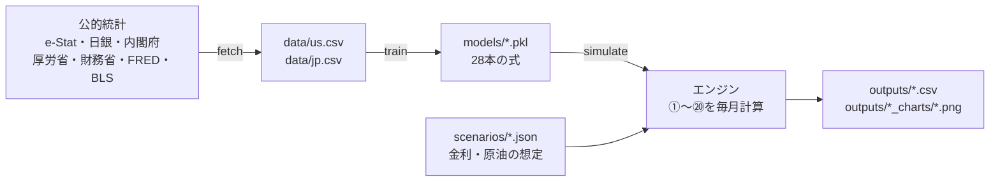

# World EconoLink Engine 初級者向けガイド

このガイドは、「経済モデルもPythonもまだ詳しくない」人に向けて、このプロジェクトが**何をしていて、コードがどう動くのか**を順番に説明します。

- 使い方だけ知りたい人は [3. まず動かしてみる](#3-まず動かしてみる) へ
- コードを読みたい人は [5. ファイルごとの解説](#5-ファイルごとの解説) へ

> 元になった論文：World EconoLink Engine v1（note 掲載）<https://note.com/ryoya1106/n/ncad5ac10002d>

---

## 目次

1. [このプロジェクトは何をするのか](#1-このプロジェクトは何をするのか)
2. [前提となる考え方（経済・統計の基礎）](#2-前提となる考え方経済統計の基礎)
3. [まず動かしてみる](#3-まず動かしてみる)
4. [全体の流れ](#4-全体の流れ)
5. [ファイルごとの解説](#5-ファイルごとの解説)
6. [結果の見方](#6-結果の見方)
7. [よくあるつまずき](#7-よくあるつまずき)
8. [用語集](#8-用語集)

---

## 1. このプロジェクトは何をするのか

**日本と米国の景気の先行きを、月ごとに予測するプログラム**です。

たとえば「日銀が政策金利を 1.0% から 1.5% に上げて、原油価格が 84ドルのままだったら、1年後の日本のGDP成長率や物価はどうなりそうか？」という問いに、数字で答えます。

やっていることを一言でいうと、次の3段階です。

1. **データを集める**：政府や中央銀行が公表している統計（物価、失業率、金利など）をインターネットから自動で取得する
2. **関係を学ぶ**：「物価は、為替や原油価格とどう連動してきたか」のような関係を、過去のデータから28本の式として求める
3. **未来を計算する**：求めた28本の式を、決まった順番で毎月1回ずつ計算し、12か月先まで予測を積み上げる

---

## 2. 前提となる考え方（経済・統計の基礎）

コードを読む前に、よく出てくる考え方を5つだけ押さえておきましょう。

### 2-1. 回帰分析（OLS）＝「過去の関係を式にする」

たとえば「GDPギャップ（景気の良し悪し）は、景気ウォッチャーの指数や輸出の量が大きいほど良くなる」という関係があるとします。過去のデータから、

```
GDPギャップ ＝ 定数 ＋ a × 景気ウォッチャー ＋ b × 輸出数量 ＋ c × 米国GDPギャップ
```

の `a, b, c` を、**実際の値と式の値のズレ（の2乗の合計）が一番小さくなるように**決める方法が **OLS（最小二乗法）** です。

このプロジェクトでは、変数ごとにこういう式を1本ずつ作り、**合計28本**持っています（日本19本・米国9本）。

### 2-2. 標準化＝「単位をそろえる」

失業率は「2.5（%）」、営業利益は「273,465（億円）」のように、変数ごとに単位も大きさもバラバラです。そのまま式に入れると、係数の大きさを比べても意味がありません。

そこで、式に入れる前に各説明変数を次のように変換します。

```
z = (値 − 平均) ÷ 標準偏差
```

こうすると、どの変数も「平均0・ばらつき1」にそろいます。係数は「その変数が**普段のばらつき1つ分**動いたら、目的変数がどれだけ動くか」という意味になり、大きさを直接比べられます。

### 2-3. ラグ（t−1、t−3 など）＝「何か月前の値か」

- `t` は「今月（当期）」
- `t−1` は「先月」、`t−3` は「3か月前」、`t−12` は「1年前」

経済には時間差があります。たとえば「円安になってから物価に効くまで数か月かかる」ので、式の説明変数には過去の値（ラグ）がよく使われます。

### 2-4. 前年比・前年差

- **前年同月比**（%）：`(今月の値 ÷ 1年前の値 − 1) × 100`。例：CPI前年比
- **前年同月差**：`今月の値 − 1年前の値`。例：長期金利の前年差

長期金利や失業率のように、ゆっくりとしか動かない変数は、水準そのものではなく「前年差」を予測して、最後に「1年前の値 ＋ 前年差」で水準に戻します（論文の式(2)）。

### 2-5. 循環カット＝「鶏と卵を避ける」

「営業利益は景気で決まり、景気は営業利益で決まる」のように、**お互いがお互いを必要とする**関係があると、どちらを先に計算すればいいか決まりません。

そこでこのモデルでは、片方を**先月の値（t−1）**にして、計算の順番が一方向に決まるようにしています。これを論文では「循環カット」と呼んでいます。

---

## 3. まず動かしてみる

### 3-1. 準備

```bash
pip install -r requirements.txt
```

`numpy`（数値計算）、`pandas`（表データ）、`statsmodels`（回帰分析）、`matplotlib`（グラフ）、`openpyxl`・`xlrd`（Excel読み込み）が入ります。

### 3-2. 本物のデータで予測する（ネット接続もキーも不要）

日米のデータ（`data/us.csv`・`data/jp.csv`）は**リポジトリに入っています**。クローンしたら、この2行で本物の予測まで出せます。

```bash
python run.py train      # ① 28本の式を推定（1分ほど）
python run.py simulate --scenario scenarios/2026-06_real.json --run-name 2026-06_real   # ② 予測
```

推定した式（`models/`）と結果（`outputs/`）は git に入れていないので、**クローンした直後は ① が必須**です。飛ばして ② だけ実行すると「学習済みモデルがありません」と言って止まります。

結果は `outputs/` フォルダにできます。

| ファイル | 中身 |
|---|---|
| `outputs/2026-06_real.csv` | 全34系列の月次の数値（実績12か月＋予測） |
| `outputs/2026-06_real_charts/dashboard_01.png` 〜 | グラフ（1枚に8個） |

グラフの日本語には和文フォントが要ります。Windows・macOS は標準で入っているものを自動で拾います。フォントの無い Linux では警告が出て豆腐（□□□）になるので、`sudo apt install fonts-ipafont-gothic` などで入れてください。

### 3-3. パイプラインの動作確認だけしたいとき

```bash
python run.py demo
```

**合成データ**（それっぽく作った架空のデータ）で、推定から予測・グラフ出力までを一気に試します。合成データは動作確認用なので、**結果に経済的な意味はありません**。

> ⚠️ `demo` を実行すると、学習済みの式（`models/`）が合成データのものに上書きされます。そのあと本物のデータで予測するときは、もう一度 `python run.py train` を実行してください。

### 3-4. データを最新に更新したいとき

同梱のデータより新しい月が要るときだけ必要です。日本の統計を取るには、e-Stat（政府統計の総合窓口）の **appId** が必要です（[無料登録](https://www.e-stat.go.jp/api/)で発行できます）。

```powershell
$env:ESTAT_APP_ID = "<あなたのappId>"
python run.py fetch      # データを取得し直す（数分かかります）
python run.py train      # 取得し直したデータで推定
```

---

## 4. 全体の流れ



| コマンド | やること | 主に使うファイル |
|---|---|---|
| `fetch` | 統計を取得して CSV に保存 | `data.py`, `sources_jp.py`, `estat.py` |
| `train` | 28本の式を推定して保存 | `estimate.py`, `equations.py` |
| `simulate` | シナリオに沿って未来を計算し、CSV と PNG を出力 | `engine.py`, `exporter.py` |
| `demo` | 合成データで上の3つをまとめて実行 | `data.py` ほか全部 |

### フォルダ構成

```
0918macro/
├── run.py                 ← 入口。コマンド（demo/fetch/train/simulate）を受け付ける
├── econolink/             ← モデル本体
│   ├── variables.py       ← 変数の一覧と名前のルール
│   ├── equations.py       ← 28本の式の「設計図」と計算順序
│   ├── estimate.py        ← 式の推定（標準化＋OLS）
│   ├── engine.py          ← 未来を1か月ずつ計算するエンジン
│   ├── exporter.py        ← CSV・PNG の出力
│   ├── data.py            ← 米国データの取得、CSVの読み込み、合成データ
│   ├── sources_jp.py      ← 日本データの取得
│   └── estat.py           ← e-Stat API との通信
├── data/                  ← 取得したデータ（CSV）
├── models/                ← 推定した式（.pkl）
├── scenarios/             ← 予測の前提条件（JSON）
├── outputs/               ← 予測結果（CSV・PNG）
└── docs/                  ← このガイド
```

---

## 5. ファイルごとの解説

### 5-1. `variables.py` ― 変数の名簿

モデルが扱う変数（日本24・米国9・原油1、合計34）の一覧です。

```python
US_FIELDS = {
    "short_rate": "FF金利(%)",
    "inflation": "CPI 前年比(%)",
    ...
}
```

**名前のルール**が2つあるので覚えておくと読みやすくなります。

| 使う場所 | 書き方 | 例 |
|---|---|---|
| プログラムの中 | `国.フィールド` | `jp.inflation` |
| CSV の列名 | `国_フィールド` | `jp_inflation` |

変換は `col()` 関数が行います（`.` を `_` に置き換えるだけ）。

`derive()` は、式を持たず**計算だけで決まる変数**（長短金利差など）を作る関数です。

```python
out["jp.term_spread"] = v["jp.long_rate"] - v["jp.short_rate"]   # 長短金利差 = 長期金利 − 短期金利
```

### 5-2. `equations.py` ― 28本の式の設計図

このプロジェクトの**心臓部**です。各式に「何を予測するか（目的変数）」と「何を使って予測するか（説明変数）」を書いています。

#### 部品になる小さな関数

```python
def L(v, k=0):    # 変数 v の k か月前の値
    return lambda g: g(v, k)

def D12(v, k=0):  # 前年同月差
    return lambda g: g(v, k) - g(v, k + 12)

def YOY(v, k=0):  # 前年同月比(%)
    return lambda g: (g(v, k) / g(v, k + 12) - 1.0) * 100.0
```

`lambda g: ...` は「あとで `g` を渡されたら計算する」という**予約された計算**です。`g(変数名, ラグ)` は「その変数の、そのラグの値をちょうだい」という関数です。

#### 式の書き方の例（日本のGDPギャップ）

```python
Equation("jp_gdp_gap_v1", "jp.gdp_gap", {
    "景気ウォッチャー(t-1)": L("jp.economy_watcher", 1),
    "輸出数量指数(t-1)": L("jp.export_volume", 1),
    "米GDPギャップ(t-1)": L("us.gdp_gap", 1),
}),
```

読み方：「`jp.gdp_gap` を、先月の景気ウォッチャー・先月の輸出数量・先月の米国GDPギャップで予測する。ファイル名は `jp_gdp_gap_v1`」。

`mode="diff12"` が付いている式（長期金利など）は、前年差を予測して水準に戻します（[2-4](#2-4-前年比前年差)）。

#### なぜ `g` を使うのか（ここがポイント）

同じ式の定義を、**学習のとき**と**予測のとき**の両方で使い回すためです。

| 場面 | `g("jp.inflation", 1)` が返すもの |
|---|---|
| 学習（`estimate.py`） | 過去データの列を1か月ずらした**列全体**（`df["jp_inflation"].shift(1)`） |
| 予測（`engine.py`） | 予測中の履歴から取った**先月の数値1つ** |

こうしておくと、「学習と予測で説明変数の作り方が食い違う」というミスが起きません。

#### 計算の順番 `STEPS`

```python
STEPS = [
    ("①", ["exog:world.oil_price", "exog:jp.short_rate"]),   # 外から与える値（シナリオ）
    ("②", ["us_unemployment_v1", "us_inflation_v1", "us_wage_v1"]),
    ...
    ("⑦", ["us_gdp_gap_v1"]),                                # ここまで米国
    ("⑧", ["jp_inflation_v1", "jp_job_openings_v1", "jp_unemployment_v2"]),  # ここから日本
    ...
    ("⑳", ["jp_operating_profit_v2"]),
]
```

**米国を先に、日本を後に**計算します。日本の為替の式が「今月の米国の金利」を使うためです（逆に、米国の式は日本の今月の値を使いません）。

### 5-3. `estimate.py` ― 式を推定する

1本の式を推定する流れ（`fit_equation` 関数）は次のとおりです。

```
① build_xy      説明変数の表 X と目的変数 y を作り、欠けている行を捨てる
② 期間で分割    2007年1月〜2025年1月を「学習用」、それ以降を「検証用」にする
③ 標準化        学習用の X から平均・標準偏差を求めて、z に変換（StandardScaler）
④ OLS           y を z で回帰して係数を求める
⑤ 検証          検証用期間で予測し、誤差（RMSE）を計算
⑥ 保存          {"model": 係数, "scaler": 平均と標準偏差, ...} を models/*.pkl に保存
```

学習時に使った**平均・標準偏差も一緒に保存する**のが大事なポイントです。予測のときも、同じ物差しで標準化しないと係数の意味が変わってしまうからです。

`train` を実行すると、式ごとに次のような表が出ます。

```
model                                 N     R2  adjR2    DW  testRMSE  status
jp_gdp_gap_v1                       217  0.761  0.758  0.92     0.885  ok
```

| 列 | 意味 | 目安 |
|---|---|---|
| N | 推定に使った月数 | |
| R2 | 式がデータの動きをどれだけ説明できたか（0〜1） | 1に近いほど当てはまりが良い |
| DW | 誤差に規則的なクセがないか | 2に近いのが理想。1未満だと誤差が続けて同じ方向に出やすい |
| testRMSE | 学習に使っていない期間での予測誤差 | 小さいほど良い（単位は目的変数と同じ） |

### 5-4. `engine.py` ― 未来を1か月ずつ計算する

#### 履歴（history）

予測は「過去の値のリスト」に、1か月分の結果を1つずつ**追加していく**形で進みます。

```
history = [実績(24か月前), ..., 実績(先月), 実績(基準月)]   ← 最初
history = [..., 実績(基準月), 予測(1か月後)]                ← 1回目の計算後
history = [..., 実績(基準月), 予測(1か月後), 予測(2か月後)] ← 2回目の計算後
```

最初に実績を24か月分入れておくのは、「13か月前の値」のような長いラグを参照する式があるためです。

#### 1か月分の計算（`_step`）

```python
def g(var, lag):
    if lag == 0:
        if var not in cur:
            raise CircularReferenceError(f"{var} の当期値は未確定です (循環カットが必要)")
        return cur[var]          # 今月の値（すでに計算済みのものだけ）
    return history[-lag][var]    # lag か月前の値
```

- `cur` は「今月の計算結果を入れる箱」です。①から⑳の順に、計算した値をどんどん入れていきます。
- `history[-1]` は先月、`history[-3]` は3か月前です（Python ではリストの後ろから数えるときにマイナスを使います）。
- **まだ計算していない今月の値を使おうとするとエラーになります。** これで、[循環カット](#2-5-循環カット鶏と卵を避ける)の漏れや、計算順序の間違いを自動で見つけられます。

#### 1本の式で予測する（`_predict`）

```python
x = np.array([float(eq.features[name](g)) for name in bundle["features"]])  # 説明変数を集める
z = bundle["scaler"].transform(x)                                           # 学習時と同じ物差しで標準化
beta = np.asarray(bundle["model"].params, dtype=float)                      # 係数
return float(eq.to_level(beta[0] + beta[1:] @ z, g))                        # 定数 + 係数×z、必要なら前年差→水準
```

`beta[1:] @ z` は「係数と z を掛けて足し合わせる」（内積）という意味です。

#### シナリオ（`Scenario`）

`scenarios/*.json` に書いた前提条件を読み込みます。

```json
{
  "base_date": "2026-06-01",
  "periods": 12,
  "jp_short_rate": [1.00, 1.00, 1.25],
  "jp_long_rate": [null],
  "oil_price": [84],
  "cpi_mode": "model",
  "add_factor_decay": 0.9
}
```

| キー | 意味 |
|---|---|
| `base_date` | 最後の実績の月（ここから先を予測） |
| `periods` | 何か月先まで予測するか |
| `jp_short_rate` | 日本の政策金利の想定。リストが短いときは最後の値が続く |
| `jp_long_rate` | `null` ならモデルで計算、数値なら固定 |
| `oil_price` | 原油価格の想定 |
| `cpi_mode` | `"model"` ならインフレ率をモデルで計算 |
| `add_factor_decay` | アドファクター（次項）。`null` で無効 |

#### アドファクター（おまけ機能）

式の予測値は、最後の実績の月でも実績とぴったりは合いません。そのズレのせいで、予測1か月目に数字が急に跳ぶことがあります。アドファクターは「基準月のズレ」を予測に足し、それを毎月 `0.9倍, 0.81倍, ...` と小さくしていくことで、跳びを抑えます。論文には無い機能なので、既定では無効です。

### 5-5. `exporter.py` ― 結果を出力する

- CSV：`result.to_csv(...)` で表をそのまま保存します（Excel で開けるよう `utf-8-sig` にしています）。
- PNG：`matplotlib` で8個ずつグラフを並べ、1枚ずつ保存します。
  - 実績は灰色の実線、予測は青の破線、基準月は縦の点線
  - GDPギャップは、プラスが青・マイナスが赤の棒グラフ

日本語が文字化けしないよう、`_set_japanese_font()` でパソコンにある日本語フォント（Yu Gothic など）を探して設定しています。

### 5-6. `data.py`・`sources_jp.py`・`estat.py` ― データを集める

どれも「インターネットからファイルや API の結果を取ってきて、月ごとの表（`pandas.Series`）に整える」という同じ仕事をしています。統計によって配布の形がバラバラなので、そのぶん関数が分かれています。

| 形 | 例 | 関数 |
|---|---|---|
| API（JSON） | e-Stat、日銀、BLS | `estat.monthly_series`, `boj_series`, `fetch_bls` |
| CSV ファイル | FRED、内閣府GDP、財務省の国債金利 | `_fred`, `qe_real_sa`, `fetch_jgb10y_monthly` |
| Excel ファイル | 有効求人数、実質賃金、住宅着工、GDPギャップ | `fetch_job_openings`, `fetch_real_wage_yoy` など |

いくつか工夫している点があります。

- **最新ファイルを毎回探す**：厚労省や内閣府のファイルは、公表のたびにファイル名やIDが変わります。そこで、一覧ページや e-Stat のファイルカタログから、毎回いちばん新しいものを探して取得します。
- **アクセスの間隔を空ける**：e-Stat に続けてアクセスすると拒否（403）されることがあるので、2秒ずつ間を空け、拒否されたら20秒待ってやり直します（`estat._get`）。
- **四半期データを月に広げる**：GDP などは3か月に1回しか出ないので、同じ値を3か月分に広げます（`_quarterly_to_monthly`）。
- **公表されている前年比を使う**：実質賃金は、自分で前年比を計算すると公式の数字とずれるため（調査対象の入れ替えなどを補正した値が公表されている）、公表値をそのまま使います。

どの変数をどの統計から取っているかは、[README の「データの出典」](../README.md#データの出典)に一覧があります。

### 5-7. `run.py` ― 入口

`python run.py fetch` のようにコマンド名を受け取り、対応する関数（`cmd_fetch` など）を呼ぶだけの薄いファイルです。`argparse` という標準ライブラリで、コマンドとオプション（`--scenario` など）を読み取っています。

---

## 6. 結果の見方

`outputs/<名前>.csv` の主な列です。

| 列 | 意味 |
|---|---|
| `period` | 基準月を 0 として、マイナスが実績、プラスが予測 |
| `jp_gdp` | 日本の実質GDP 前年比(%) |
| `jp_gdp_gap` | 日本のGDPギャップ(%)。プラスなら需要が強め、マイナスなら弱め |
| `jp_inflation` | 日本のCPI 前年比(%) |
| `jp_usd_jpy` | ドル円 |
| `us_short_rate` | 米国の政策金利（FF金利） |

読むときの注意：

- **1本の「予言」ではなく、「この前提ならこうなる」という計算結果**です。前提（シナリオ）を変えて比べる使い方が向いています。
- 予測の**ぶれ幅（信頼区間）は出していません**。遠い先ほど不確かになります。
- 係数は過去（2007〜2025年）の関係から作っているので、過去に無かったような状況では当てはまりにくくなります。

---

## 7. よくあるつまずき

| 症状 | 原因と対処 |
|---|---|
| `学習済みモデルがありません (... が空です)` | クローンした直後で `models/` が空です。先に `python run.py train` を実行してください（データは同梱なので appId は不要） |
| `環境変数 ESTAT_APP_ID に e-Stat の appId を設定してください` | appId が未設定です。`fetch`（データの更新）にだけ必要です。[3-4](#3-4-データを最新に更新したいとき)の `$env:ESTAT_APP_ID = ...` を先に実行してください |
| `base_date ... の実績データがありません` | シナリオの `base_date` が新しすぎます。統計によって公表時期が違うので、すべての系列がそろっている月（例：`2026-06-01`）にしてください |
| 予測の数字が明らかにおかしい | 直前に `demo` を実行していませんか？ `models/` が合成データのものになっています。`python run.py train` をやり直してください |
| `モデル未学習のため前期値を保持する変数: [...]` という警告 | その式を推定できていません（データが足りないなど）。`train` の表で `status` が `skip` になっていないか確認してください |
| `CircularReferenceError` | `equations.py` を書き換えて、まだ計算していない変数の「今月の値」を使っています。その説明変数をラグ付き（`t-1`）にするか、`STEPS` の順番を見直してください |
| グラフの日本語が「□」になる | 日本語フォントが見つかっていません。`日本語フォントが見つかりません` という警告も出ているはずです。Windows・macOS は標準フォントを自動で拾います。Linux では `sudo apt install fonts-ipafont-gothic` などで入れてください |

---

## 8. 用語集

| 用語 | 説明 |
|---|---|
| マクロ計量モデル | 経済全体（GDP・物価・雇用など）の関係を、統計的に推定した式の集まりで表すモデル |
| 目的変数 / 説明変数 | 式で予測したい変数 / 予測に使う変数 |
| OLS（最小二乗法） | 実際の値と式の値のズレの2乗の合計が最小になるように、係数を決める方法 |
| 標準化 | 平均0・標準偏差1にそろえる変換。単位の違う変数を比べやすくする |
| ラグ | 何か月前の値を使うか。t−1 は先月 |
| 前年同月比 / 前年同月差 | 1年前と比べた変化率(%) / 変化の大きさ |
| GDPギャップ | 実際のGDPと、経済の実力（潜在GDP）との差(%)。プラスは景気過熱気味、マイナスは需要不足 |
| 季節調整 | 「12月は毎年消費が多い」のような季節ごとの決まった動きを取り除く処理 |
| 外生変数 / シナリオ | モデルの外から人が与える値（政策金利・原油価格など） |
| 循環カット | お互いを必要とする変数の片方を先月の値にして、計算順序を一方向にする工夫 |
| ブロック再帰 | 米国のまとまり → 日本のまとまり、のように順番に解いていく計算方法 |
| 決定係数（R²） | 式がデータの動きをどれだけ説明できたか（0〜1） |
| DW（ダービン・ワトソン比） | 誤差に規則的なクセがあるかを見る数値。2に近いのが理想 |
| RMSE | 予測誤差の大きさの平均的な目安 |
| pickle（.pkl） | Python のデータをそのままファイルに保存する形式 |
| API | プログラムから決まった形でデータを取得するための窓口 |
| e-Stat | 日本の政府統計の総合窓口。API で統計を取得できる |
| FRED / BLS | 米セントルイス連銀の経済データベース / 米労働統計局 |
